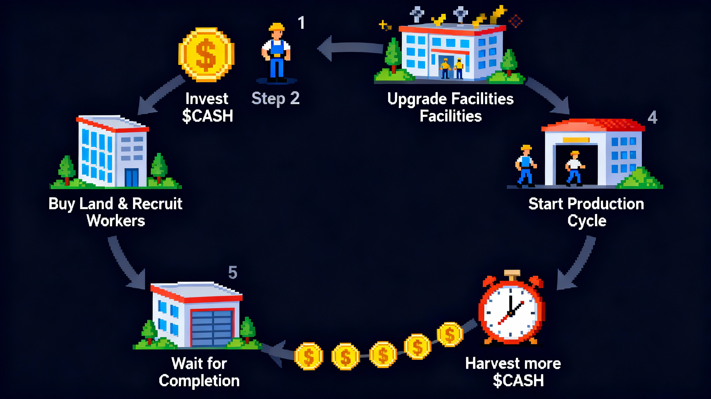

# FinanceWorld Whitepaper — Chapter 1 · Welcome to an On‑Chain Economy You Shape

## 0. Preface — Welcome to FinanceWorld
- We don’t craft fleeting fantasies; we build durable systems.
- FinanceWorld is not another short‑lived game. It is a pure economic strategy sandbox, built on the high‑performance Monad blockchain. Our design philosophy comes from a simple, powerful belief: a truly engaging virtual world should derive its appeal not from nebulous narrative, but from clear, rigorous, player‑exploitable rules.
- What you’re entering is a persistent economy defined entirely by on‑chain smart contracts. There are no backdoors, no randomness, and no “patch day answers.” The only winning path is intelligent capital allocation and strategy to maximize returns.
- Every decision you make sends ripples through the economy, shaping your personal wealth trajectory and, collectively, the tides of this micro financial world.
- Welcome to FinanceWorld. Welcome to real game theory.

## 1. Core Principles and Game Overview
### 1.1 Vision — A Durable, Transparent Financial Sandbox
- We address two core pain points common in crypto gaming: short lifecycles and fragile economies. We anchor on three pillars:
  - Minimalism, deep strategy: We trim away non‑essential complexity. The core loop is “Input → Production → Return,” yet each link—land selection, facility upgrades, and macro community voting—is rich with meaningful choices.
  - Built‑in deflation, value first: The native token $CASH is designed with deflationary mechanics. The more vibrant the in‑game economy, the greater the burn. We pursue mathematically defensible, long‑term value—not short‑term bubbles.
  - Pure on‑chain, absolute fairness: All core gameplay and economics execute via smart contracts—public, transparent, verifiable. Here, code is law.

### 1.2 The Core Loop — From $CASH to More $CASH
- Visual overview of how capital compounds in FinanceWorld:
  - Figure‑1: Core Loop
  
  
- In short: you allocate $CASH to acquire land and recruit workers, then strengthen operations by upgrading facilities. You start production cycles, wait, and harvest more $CASH. It’s a positive feedback loop of scaling and optimization.

### 1.3 Why FinanceWorld Is Different
- Private, non‑transferable land: Your land is permanently yours and non‑transferable. This eliminates land speculation and refocuses the experience on operations—not flipping.
- Player‑driven macroeconomy: Baseline productivity and tax rates are not set by devs, but voted weekly by all $CASH stakers. You’re not just a player—you’re one of the central bankers.
- High‑risk arena (IPO Round): Beyond steady operations, a 24/7 IPO mode offers a pure contest of nerve, timing, and capital.

### 1.4 Glossary
- $CASH: The sole in‑game economic and governance token.
- Land: Your core production asset; the foundation of all activities.
- Workers: Your labor units; one‑time recruitment, then permanent.
- Facilities: Per‑land “enhancement modules” (Bank, Factory, Exchange) that boost local efficiency.

