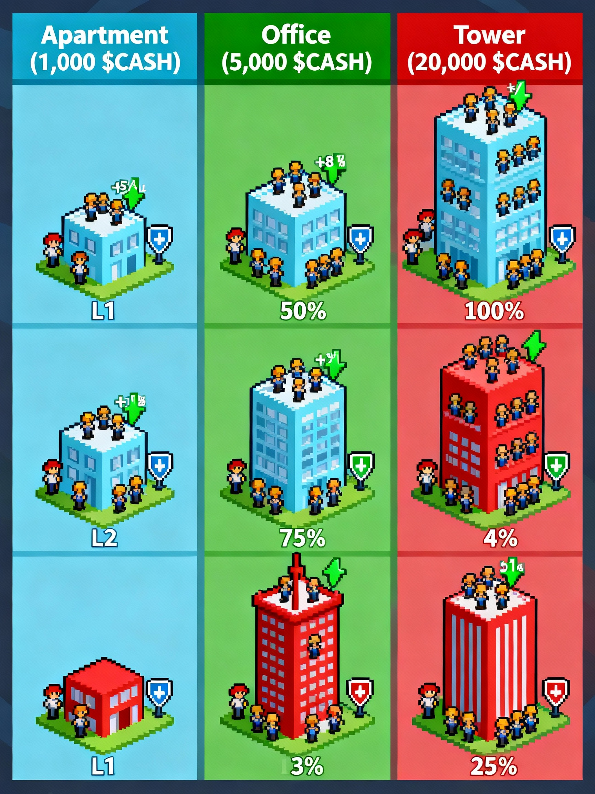
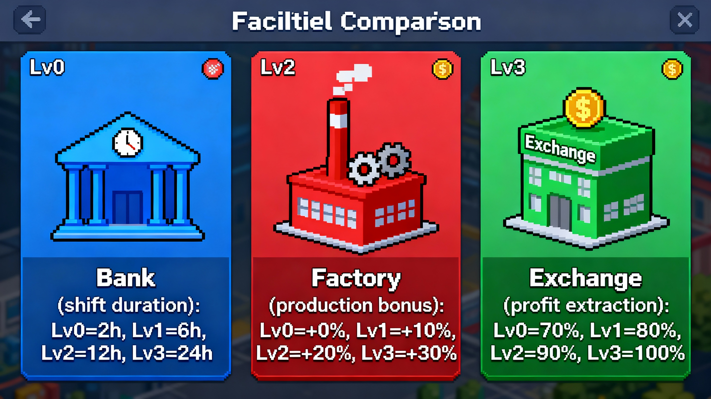

# FinanceWorld Whitepaper — Chapter 2 · Your Business Empire

## 2.0 Preface — From One Plot to a City
- Your empire is built on three calculable and upgradable pillars: Land, Workers, and Facilities. Mastering them is step one to mastering FinanceWorld.

## 2.1 Land & Workers — Your Base
### Land — the starting point
- Land is required to run production. You purchase land with $CASH. It is permanently yours and non‑transferable (to avoid speculation and keep focus on operations). There’s no cap on how many plots you own.

### Three land tiers, three launch pads (prices in $CASH)
- Apartment: 1,000 — best starter ROI, bootstraps your first cash‑flow engine.
- Office: 5,000 — stronger capacity and efficiency, the backbone for scaling.
- Skyscraper: 20,000 — ultimate potential and prestige.

### Land value by type and level (Lv1→Lv3)
- Capacity = max concurrent workers on that plot; Productivity bonus multiplies gross; Tax shield reduces effective tax.

| Land Type   | Level | Capacity | Productivity Bonus | Tax Shield |
|-------------|-------|----------|--------------------|------------|
| Apartment   | Lv1   | 20       | +5%                | −1%        |
| Apartment   | Lv2   | 30       | +8%                | −2%        |
| Apartment   | Lv3   | 40       | +10%               | −3%        |
| Office      | Lv1   | 50       | +10%               | −2%        |
| Office      | Lv2   | 75       | +15%               | −3%        |
| Office      | Lv3   | 100      | +20%               | −4%        |
| Skyscraper  | Lv1   | 120      | +15%               | −3%        |
| Skyscraper  | Lv2   | 180      | +20%               | −4%        |
| Skyscraper  | Lv3   | 240      | +25%               | −5%        |

### Workers — your labor
- Recruitment cost: 100 $CASH per worker (one‑time). Permanently yours and reusable across shifts.

## 2.2 The Three Facilities — Bank, Factory, Exchange
- Facilities are per‑land enhancements and only affect the land they’re built on. Specialize plots for distinct strategies.

### Build rule (Lv1 unlock)
- First unlocking any facility to Lv1 on a plot requires a small native token payment as a one‑time anti‑bot gate.
- Monad testnet reference: 0.1 MON. Mainnet value is parameterized/governed and may change. Frontends must always read `nativeUnlockPrice()` on‑chain (do not hard‑code).

### Bank — the tempo of efficiency (sets unique shift length)
- Bank level uniquely determines allowed shift hours on a land:
  - Lv0: 2h · Lv1: 6h · Lv2: 12h · Lv3: 24h

### Factory — the amplifier of profits (multiplies gross)
- Lv0: +0% · Lv1: +10% · Lv2: +20% · Lv3: +30%

### Exchange — protector of wealth (how much you can extract)
- Extraction ratio / Burned remainder:
  - Lv0: 70% extract / 30% burned
  - Lv1: 80% / 20%
  - Lv2: 90% / 10%
  - Lv3: 100% / 0%

## 2.3 The Yield Engine — Production and Payout
- Start Shift: Choose a land, allocate workers (≤ capacity), and prepay the wage. Allowed hours are uniquely determined by that land’s Bank level (2/6/12/24h).
- Wait: Let the shift run for its full hours.
- Claim: After the shift ends, claim your net payout.
- Deterministic net: Net is precisely computable from your assets (land level, facilities) and macro parameters (district productivity/tax).
- Deflation in action: 100% of the prepaid wage and the un‑extracted portion (due to lower Exchange levels) are irrevocably burned.

