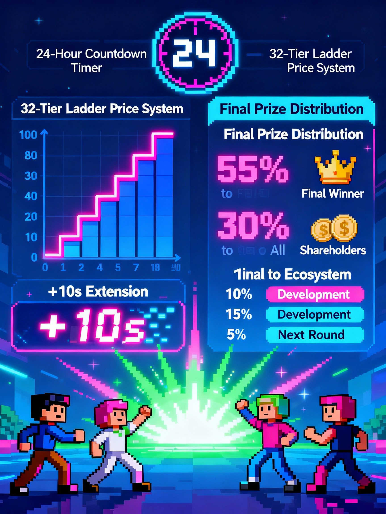

# FinanceWorld Whitepaper — Chapter 3 · Global Play (Governance & IPO)

## 3.0 Preface — Strategy at the Macro Layer
- Personal optimization is the baseline. The true winners leverage macro rules across the entire world: weekly governance and the IPO arena.

## 3.1 Weekly Governance & Staking
- District macro parameters drive local profitability:
  - Productivity: 85%–130% (multiplies gross)
  - Tax Rate: 1%–18% (reduces after‑tax core)
- Stake $CASH to vote (7‑day lock). Staking grants voting power and continuous per‑second rewards from a community rewards pool.
- Two‑way win:
  - “Heaven build”: rally your district for high productivity and low tax to boost active income.
  - “Macro balance”: support balanced tax for a healthier system and potentially larger staking rewards.
- Capital → power → yield: More stake = more influence and higher daily rewards.

## 3.2 The IPO Round — A 24h Peak Showdown
- A permanent, 24‑hour, high‑risk/high‑reward arena independent of production.
- Rules summary:
  - Players buy “shares” with $CASH during a 24h countdown.
  - Price follows a 32‑tier cumulative ladder based on total shares sold this round—later buyers pay more.
  - Each buy extends the soft timer by +10s per share (capped at +120s per tx), never beyond the 24h hard cap.
- Payout when time hits zero (pot distribution):
  - 55% to the final buyer (winner)
  - 30% to all shareholders pro‑rata
  - 10% to development/operations
  - 5% seeds the next round

