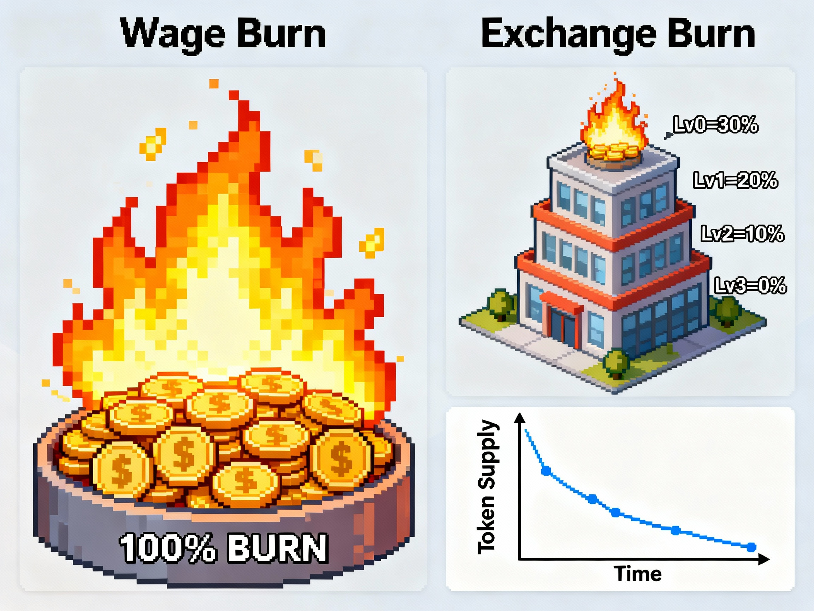

# FinanceWorld Whitepaper — Chapter 4 · $CASH Token Economics

## 4.0 Preface — Beyond “Play‑to‑Earn”
- Many crypto games spiral into early inflation and late collapse. FinanceWorld optimizes for sustainability with real, on‑chain sinks.

## 4.1 Core Value — Strong Built‑In Deflation
- Wage Burn (hard sink): 100% of prepaid wages are burned on every shift.
- Efficiency Burn (hard sink): Any un‑extracted profit (due to low Exchange level) is also 100% burned.
- The more activity, the more burn—supply declines with adoption.

## 4.2 Token Lifecycle — Source to Sinks
- Sources:
  - Operational net profit (from shifts)
  - Staking rewards (per‑second)
- Sinks & Locks:
  - Hard burns: Wages; un‑extracted profits; 10% of IPO buy‑ins
  - Reinvestment: Land purchases; facility upgrades; worker hiring
  - Temporary locks: Staking (7‑day lock); IPO pot/div pools

## 4.3 Allocation (Illustrative)
- Total Supply: 100,000,000 $CASH (fixed cap)

| Category               | Share | Purpose                                               |
|------------------------|-------|-------------------------------------------------------|
| Community & Incentives | 52%   | Gameplay emissions, staking rewards, community grants |
| Liquidity & MM         | 10%   | Initial DEX liquidity and stability                   |
| Team & Advisors        | 16%   | 3‑year cliff + linear vest, long‑term alignment       |
| Treasury               | 10%   | Multisig/DAO‑managed strategic reserves               |
| Public Presale         | 12%   | Fair launch for early community participation         |

