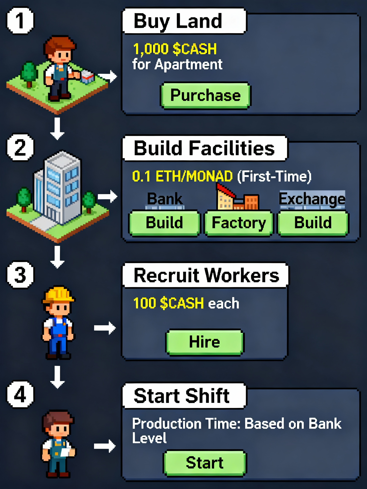

# FinanceWorld Whitepaper — Chapter 5 · From Zero to One (Quick Start)

## 5.0 Preface — Where Theory Becomes Action
- A hands‑on starter to run your first profitable shift and plan your growth.

## 5.1 Your First Shift — Step‑by‑Step
1) Buy your first land — Apartment (1,000 $CASH)
   - Keep enough $CASH for workers and wages.
2) Recruit your core team — 10–20 workers (100 $CASH each)
3) Unlock key facilities (suggested order)
   - Exchange Lv1 (priority): raises extraction from 70%→80% (instant net boost)
   - Factory Lv1 (second): +10% gross multiplier
   - Bank Lv1 (optional early): unlocks longer shifts; short cycles can be better at small scale
   - Lv1 unlock payment: Monad testnet reference is 0.1 MON; mainnet value is parameterized and may change; always read `nativeUnlockPrice()` on‑chain.
4) Start your first shift
   - Allocate workers ≤ capacity; prepay wage; run 2/6/12/24h based on Bank level
   - Claim manually at end to realize net

## 5.2 Early‑Game Strategy
- Cash is king: always keep enough for the next wage.
- Snowball reinvestment (suggested order): Exchange→Factory→more workers→more land/upgrades→Bank.
- Don’t ignore macro: stake idle $CASH to earn and vote for favorable district params.

## 5.3 FAQ
- How much do I need to start?
  - Suggest: Apartment (1,000), 20 workers (2,000), plus a few wage cycles. More capital accelerates growth.
- Can I sell land?
  - No. Land is permanently bound to your account to preserve strategic depth.
- What if I forget to claim?
  - Rewards remain safely in the contract until you claim. Claiming sooner lets you reinvest and compound earlier.
- Is this too complex?
  - It’s math and strategy—not luck. Rules are transparent. If you plan better and calculate sharper, you can win.

## 5.4 Closing
- The blueprint is yours. The world awaits your touch. See you on Monad.

## 5.5 Notes & Disclaimers
- Native Lv1 unlock payment: 0.1 MON on Monad testnet today; actual mainnet value is subject to governance/parameters. Frontends must read `nativeUnlockPrice()` from the contract and must not hard‑code constants.
- All gameplay and economy details are enforced by on‑chain code; where this document and contracts diverge, contracts prevail.

