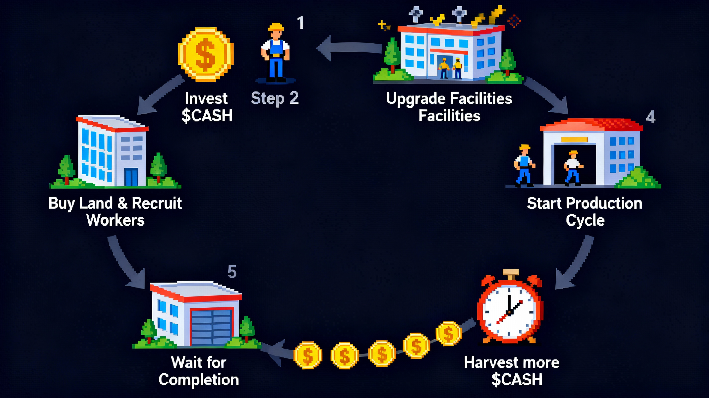
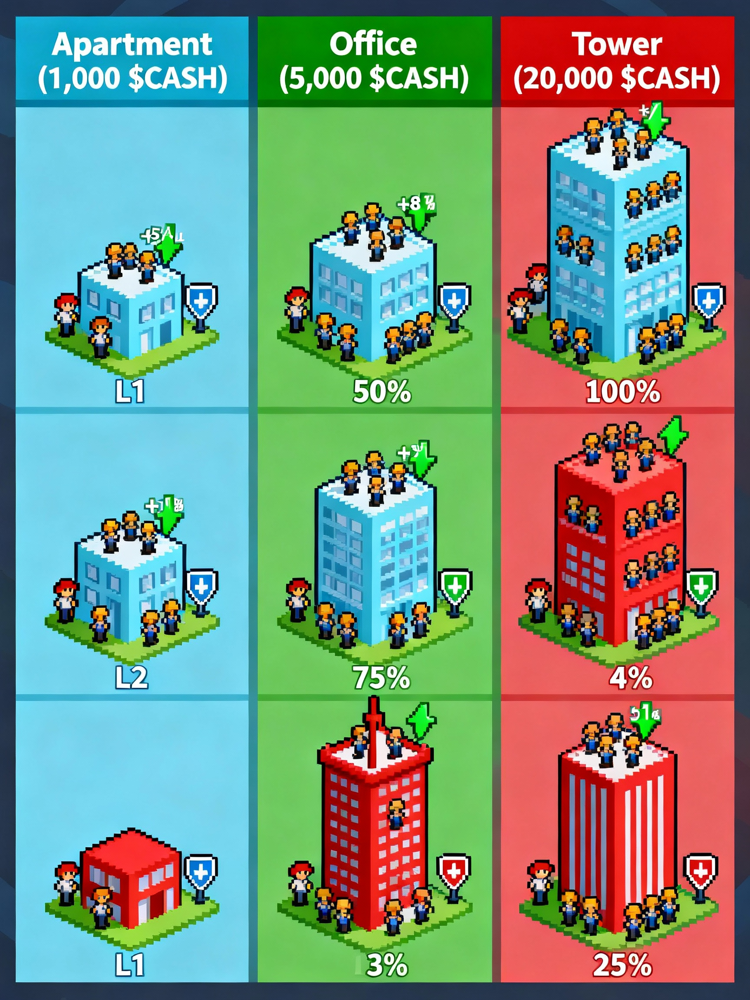

# FinanceWorld Whitepaper

**FinanceWorld Whitepaper**

title: 1.1 Vision

### 1.1 · Vision — a durable, transparent financial sandbox

* Minimal core, deep strategy: input → production → return.
* Value first: as the world gets busier, the economy stays healthy.
* Fair by design: simple rules applied equally.

FinanceWorld in one minute

* Buy land, hire workers, run shifts, upgrade — earn more $CASH.
* Deterministic rules; no hidden knobs.

Who it’s for

* Casual players, strategy lovers, and crypto newcomers.

How it feels to play

* One or two long shifts per day or several short cycles.
* Reinvest: exchange → factory → more workers → land → bank.

title: 1.2 The core loop

### 1.2 · The core loop — from $CASH to more $CASH

* Visual overview of how capital compounds in FinanceWorld.

In short

* Use $CASH to acquire land and hire workers.
* Strengthen operations by upgrading facilities.
* Start shifts, wait, and claim — repeat with a bigger base.

title: 1.3 Why different

### 1.3 · Why FinanceWorld is different

* Land is private and non‑transferable — no land flipping meta.
* Weekly player input nudges area settings instead of dev hand‑tuning.
* A 24/7 IPO arena adds high‑risk, high‑reward excitement.

\{% hint style="info" %\}

No crypto knowledge required. Connect a wallet; UI uses plain words.

\{% endhint %\}

title: 2.1 Land & workers

### 2.1 · Land & workers — your base

### Land — the starting point

* Land is required to run production. You buy it with $CASH and it remains yours.

#### Three land tiers

* Apartment (1,000) — best starter ROI.
* Office (5,000) — stronger capacity and efficiency.
* Skyscraper (20,000) — ultimate potential.

#### Land value by level

\| Land Type | Lv1 | Lv2 | Lv3 |

\|-----------|-----|-----|-----|

\| Apartment | cap 20 • +5% • −1% | cap 30 • +8% • −2% | cap 40 • +10% • −3% |

\| Office | cap 50 • +10% • −2% | cap 75 • +15% • −3% | cap 100 • +20% • −4% |

\| Skyscraper| cap 120 • +15% • −3% | cap 180 • +20% • −4% | cap 240 • +25% • −5% |

### Workers — your labor

* One‑time cost: 100 $CASH per worker. Permanent.

Your first gameplay loop

1\) Buy land

2\) Hire workers

3\) Start a shift

4\) Claim profit

Districts at a glance

* Six districts with weekly settings.
* Diversify to smooth swings.

title: 2.2 Facilities

### 2.2 · Facilities — bank, factory, exchange

* Per‑land enhancements; specialize your plots.

### Build rule (Lv1 unlock)

\{% hint style="info" %\}

The first time you build any facility, there is a small one‑time native‑coin payment to unlock Level 1 (on the test version it’s 0.1 MON). The official price for the live release will be announced. Later upgrades use $CASH.

\{% endhint %\}

### Bank — tempo of efficiency

* Allowed shift hours by level: 2 / 6 / 12 / 24.

### Factory — amplifier of profits

* +10% / +20% / +30% gross.

### Exchange — protector of wealth

* Take‑home ratio by level: 70% / 80% / 90% / 100%.

title: 2.3 Yield engine

### 2.3 · The yield engine — production and payout

* Start a shift: choose a land, pick workers (up to capacity), pay salaries upfront.
* Let it run: 2 / 6 / 12 / 24 hours depending on Bank.
* Get paid: when it ends, tap “claim” to receive your earnings.
* What affects earnings: land level, facilities, and weekly settings.
* Health of the world: upfront salaries are a sunk cost; at lower Exchange levels a small slice is forgone — both help balance the economy.

Quick economics (easy math)

* Your team produces gross sales; a small public cut goes to the pot.
* How much you take home depends on Exchange level.
* Subtract the salaries you prepaid — the rest is profit.

\{% hint style="note" %\}

Paying salaries upfront is intentional: it keeps the world healthy and rewards thoughtful planning.

\{% endhint %\}

title: 3.1 Weekly rules & rewards

### 3.1 · Weekly community rules & rewards

* Each area has two simple dials: productivity and the shared pot.
* Set funds aside to earn a steady trickle and gain a say in next week’s settings.

Weekly routine

* Set funds aside to earn and gain a voice.
* Once a week, suggest settings for each area.
* The game applies the new settings next week.

Player mindsets

* Operator: push for lower burden and higher output where you operate.
* Balance‑seeker: keep things even to grow the shared pot.
* Coordinator: build coalitions for stability.

title: 3.2 IPO round

### 3.2 · The IPO round — a 24h peak showdown

\{% hint style="warning" %\}

IPO is entertainment with real risk. Each purchase adds a little time, but never beyond 24 hours. Use a small, pre‑decided budget.

\{% endhint %\}

Why early entries can still win

* Last buyer takes 55% of the pot.
* All shareholders share 30% pro‑rata.
* Early buyers can be net positive via dividends even without being last.

title: 4.1 Core value

### 4.1 · A system that stays healthy as it grows

* Upfront salaries are real cost, like payroll.
* Not everything is taken home at lower exchange levels.
* The busier the world, the more these taps work — helping $CASH stay meaningful.

Where value comes from

* Healthy taps: upfront salaries and the tiny slice you don’t take home.
* Ongoing demand: operations, upgrades, growth, and setting funds aside for rewards.

title: 4.2 Lifecycle

### 4.2 · Token lifecycle — where it comes from and where it goes

Sources

* Profits from your shifts
* Rewards for those who set funds aside

Uses

* Salaries and the small slice you don’t withdraw
* Re‑investment: land, facilities, more workers
* Temporary parking: reward pools and event pots

Sustainability levers

* How you play → longer shifts and stronger facilities raise output and balance taps together.
* Weekly settings → area choices steer both personal profit and the shared pot.
* Scale → more players mean more activity, which feeds both profit and balance.

\{% hint style="note" %\}

As activity rises, both player profit and balance‑keeping taps rise together — avoiding runaway inflation.

\{% endhint %\}

### Allocation (illustrative)

* Total supply: 100,000,000 $CASH (fixed cap)

\| Category | Share | Purpose |

\|------------------------|-------|-------------------------------------------------------|

\| Community & Incentives | 52% | Gameplay emissions, staking rewards, community grants |

\| Liquidity & MM | 10% | Initial DEX liquidity and stability |

\| Team & Advisors | 16% | 3‑year cliff + linear vest, long‑term alignment |

\| Treasury | 10% | Multisig/DAO‑managed strategic reserves |

\| Public Presale | 12% | Fair launch for early community participation |

\{% hint style="info" %\}

In test environments the first facility unlock costs about \*\*0.1 MON\*\*. The official live price will be announced with the launch.

\{% endhint %\}

title: 5.1 First shift

### 5.1 · Your first shift — step‑by‑step

1\) Buy an Apartment (1,000 $CASH). Keep enough for workers and salaries.

2\) Hire 10–20 workers.

3\) Unlock Exchange Lv1 (more of your earnings reach you). Factory Lv1 next; Bank Lv1 unlocks longer shifts.

4\) Start a 12h shift; claim at the end.

48‑hour starter plan

* T0: Apartment, hire, Exchange Lv1 → start 12h shift
* T+12h: Claim, Factory Lv1 → start another 12h
* T+24h: Set a portion aside for rewards; start 24h if Bank allows
* T+48h: Review net; consider a second land or stronger Exchange

title: 5.2 Strategy

### 5.2 · Early‑game strategy

* Cash is king: always keep enough for the next salary cycle.
* Snowball reinvestment: Exchange → Factory → more workers → land → Bank.
* Don’t ignore weekly settings: favor areas that match your plan.

Common pitfalls

* Idle workers: keep capacity utilized.
* Thin cash buffer: don’t stall production.
* Over‑index on one area: diversify to reduce policy swings.

\{% hint style="success" %\}

Best practice: prioritize \*\*Exchange → Factory → more workers → land upgrades → Bank\*\*.

\{% endhint %\}

title: 5.3 FAQ

### 5.3 · FAQ

Q: Will I miss profits if I can’t log in often?

A: No. Shifts run to completion and unclaimed rewards remain safe until you claim. Longer shifts (12–24h) minimize check‑ins.

Q: Are taxes developer revenue?

A: No. Taxes feed the shared rewards pot for everyone who set funds aside.

Q: Do I need crypto knowledge?

A: No. Connect a wallet and confirm; the UI uses plain words.
